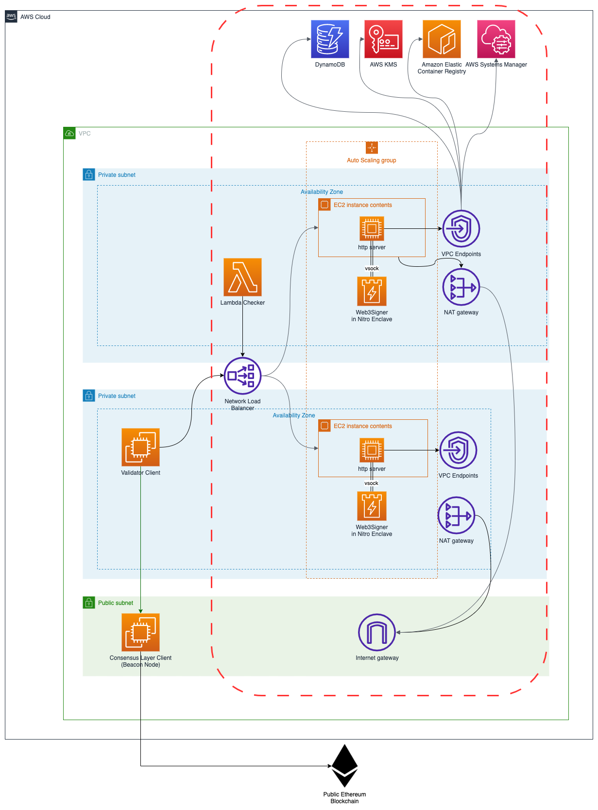

# AWS Nitro Enclave Blockchain Validator (Web3Signer)

This project represents an example implementation of an AWS Nitro Enclave
based [Consensys Web3Signer](https://github.com/ConsenSys/web3signer) deployment which is commonly used as a remote
signer instance for [EIP-3030](https://eips.ethereum.org/EIPS/eip-3030) compatible
blockchain [validator nodes](https://ethereum.org/en/developers/docs/consensus-mechanisms/pos/#transaction-execution-ethereum-pos).
A single Web3Signer deployment can be used by several Ethereum validator nodes.

The project is implemented in AWS Cloud Development Kit (CDK) v2 and Python.

This repository contains all code artifacts for the following two blog posts. A walkthrough, explaining how to deploy
and configure the solution is enclosed in the `docs` folder of this repository.

[//]: # (1. [AWS Nitro Enclaves for running Ethereum validators &#40;Part 1&#41;]&#40;www.example.com&#41;)
[//]: # (2. [AWS Nitro Enclaves for running Ethereum validators &#40;Part 2&#41;]&#40;www.example.com&#41;)
1. [AWS Nitro Web3Signer Solution Walkthrough](./docs/walkthrough.md)

[//]: # (For an overview of how to design an AWS Nitro Enclave secured blockchain validation process, please have a look at)

[//]: # (the [first blog post]&#40;www.example.com&#41;.)

[//]: # ()
[//]: # (For a deep dive into AWS Nitro Enclave based Web3Signer node setup and integration patterns, a deep dive of how to)

[//]: # (bootstrap https endpoints inside AWS Nitro Enclave environment or how to securely tunnel https traffic over a vsock)

[//]: # (socket, please refer to [second blog post]&#40;www.example.com&#41;.)

For a walkthrough on how to deploy, bootstrap, configure and start the Nitro Enclave secured Web3Signer process, please
refer to the [walkthrough](./docs/walkthrough.md).

## Solution overview

### Deployment overview



### Application overview and high-level bootstrapping flow


1. Systemd watchdog services reads encrypted validator BLS and TLS keys.
2. Watchdog service sends `init` request to Enclave with key configuration enclosed.
3. Enclave leverages AWS Nitro SDK (`kmstool-enclave-cli`) to decrypt encrypted keys.
4. Cryptographic attestation is being used by the `kmstool-enclave-cli`.
5. After decryption, keys are being stored in ephemeral storage of AWS Nitro Enclave.
6. Web3Signer process is started inside enclave using decrypted keys, listening on `https` endpoint.
7. Validator sends `https` signing request to `https_proxy`.
8. Request gets forwarded via `vsock` to Web3Signer running inside the enclave and gets processed.

For a more detailed explanation of the bootstrapping process please refer to the bootstrapping section of
the [walkthrough](./docs/walkthrough.md#bootstrapping-flow).

## Solution Walkthrough

* [AWS Nitro Web3Signer Solution Walkthrough](./docs/walkthrough.md)

## Development

### Prerequisites

* An [AWS account](https://signin.aws.amazon.com/signin?redirect_uri=https%3A%2F%2Fportal.aws.amazon.com%2Fbilling%2Fsignup%2Fresume&client_id=signup)
* An [AWS Identity and Access Management](http://aws.amazon.com/iam) (IAM) user with administrator access
* [Configured AWS credentials](https://docs.aws.amazon.com/cdk/latest/guide/getting_started.html#getting_started_prerequisites)
* [Docker](https://docs.docker.com/get-docker/), [Node.js](https://nodejs.org/en/download/)
  , [Python 3.9](https://www.python.org/downloads/release/python-3916), [pip](https://pip.pypa.io/en/stable/installing/),
  and [jq](https://stedolan.github.io/jq/) installed on the workstation that you plan to deploy the solution from.

Note that the solution is **only** compatible with Python 3.9.

### Deploy with AWS CDK

* virtual environments ([venv](https://docs.python.org/3/library/venv.html#module-venv)) are recommended working with
  Python
* AWS CDK per default leverages virtual
  environments. [See how to activate virtualenv](https://cdkworkshop.com/30-python/20-create-project/200-virtualenv.html)

   ```shell
   npm install -g aws-cdk && cdk –version
   ```

To deploy the **development** version (cryptographic attestation turned off) of the sample application please follow the
steps below:

1. Install the AWS CDK and test the AWS CDK CLI:

   ```shell
   npm install -g aws-cdk && cdk –version
   ```

2. Download the code from the GitHub repo and change to the new directory:

   ```shell
   git clone https://gitlab.aws.dev/proserve-es/publicblockchain/nitro_validator_cdk
   ```

3. Change to the nitro_validator_cdk repository:

   ```shell
   cd nitro_validator_cdk
   ```

4. Install the dependencies using the Python package manager:

   ```shell
   pip install -r requirements.txt
   pip install -r requirements-dev.txt
   ```

5. Run linter and code scan on all files

   ```bash
   pre-commit run --all-files
   ```

6. Build the required binaries for Nitro Enclaves. This step requires a valid local Docker environment.

   ```shell
   ./scripts/build_kmstool_enclave_cli.sh
   ```

   After you run this step, a new folder (application/eth2/enclave/kms) is available that contains the required Nitro
   Enclaves artifacts.

   If you encounter a problem with the `build_kmstool_enclave_cli.sh` step, such as a network connectivity issue, you
   can turn on the debug output of the script by changing set +x to set -x inside the script.

   For additional information, refer to the GitHub repo.

7. (Optional) If you have deployed the validator key table and KMS key
   using [Generate validator keys for Ethereum with trusted code in AWS Lambda and AWS Signer](https://github.com/aws-samples/eth-keygen-lambda-sam),
   modify the code in [app.py](../app.py) to specify the `kms_arn` and `validator_key_table_arn`. Else, skip this step.

8. Deploy the sample code with the AWS CDK CLI:

   ```shell
   cdk deploy devNitroValidator -O output.json
   ```

### Production Deployment

Production deployment enables cryptographic attestation feature. No console access possible to enclave.
The deployment process is the same as described in the `development` section above besides the `cdk deployment step` (
step 2 above):

```shell
cdk deploy prodNitroSigner -O output.json
```

Follow all subsequent steps from the dev deployment pointed out above.

## Security

See [CONTRIBUTING](CONTRIBUTING.md#security-issue-notifications) for more information.

## License

This library is licensed under the MIT-0 License. See the LICENSE file.
