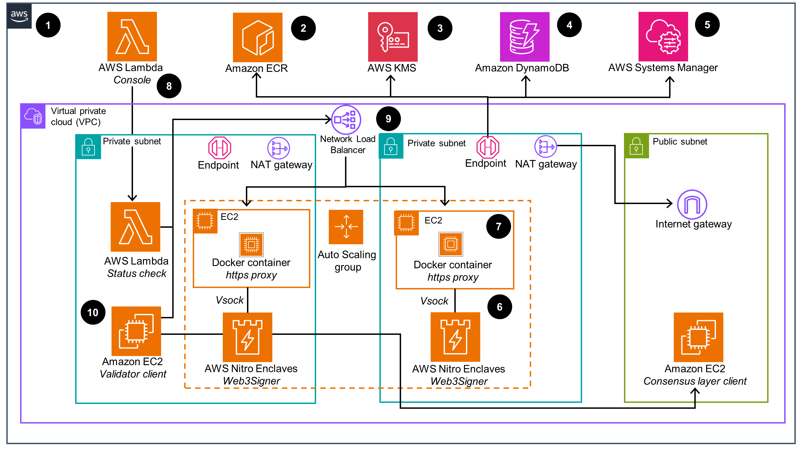
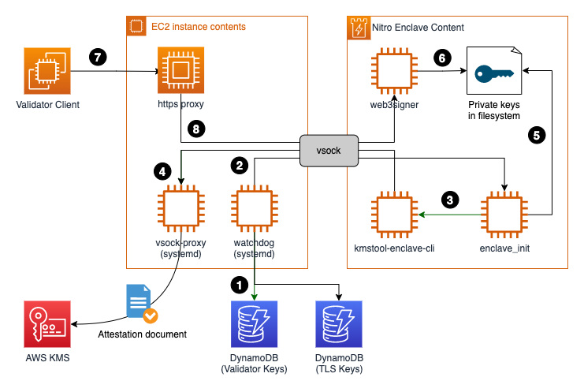

# Guidance for Secure Blockchain Validation using AWS Nitro Enclaves

This project represents an example implementation of an [AWS Nitro Enclave](https://aws.amazon.com/ec2/nitro/nitro-enclaves/)
based [Consensys Web3Signer](https://github.com/ConsenSys/web3signer) deployment which is commonly used as a remote
signer instance for [EIP-3030](https://eips.ethereum.org/EIPS/eip-3030) compatible
blockchain [validator nodes](https://ethereum.org/en/developers/docs/consensus-mechanisms/pos/#transaction-execution-ethereum-pos).
A single Web3Signer deployment can be used by several Ethereum validator nodes.

The project is implemented in [AWS Cloud Development Kit](https://aws.amazon.com/cdk/) (CDK) v2 and Python.

This repository contains all code artifacts for the following two blog posts. A walkthrough, explaining how to deploy
and configure the guidance is enclosed in the `docs` folder of this repository.

1. [AWS Nitro Enclaves for running Ethereum validators – Part 1](https://aws.amazon.com/blogs/database/aws-nitro-enclaves-for-running-ethereum-validators-part-1/)
2. [AWS Nitro Enclaves for running Ethereum validators – Part 2](https://aws.amazon.com/blogs/database/aws-nitro-enclaves-for-running-ethereum-validators-part-2/)
3. [AWS Nitro Web3Signer guidance walkthrough](./docs/walkthrough.md)

For an overview of how to design an AWS Nitro Enclave secured blockchain validation process, please have a look at [Part 1](https://aws.amazon.com/blogs/database/aws-nitro-enclaves-for-running-ethereum-validators-part-1/).

For a deep dive into AWS Nitro Enclave based Web3Signer node setup and integration patterns, a deep dive of how to
bootstrap https endpoints inside AWS Nitro Enclave environment or how to securely tunnel https traffic over a vsock
socket, please refer to [Part 2](https://aws.amazon.com/blogs/database/aws-nitro-enclaves-for-running-ethereum-validators-part-2/).

For a walkthrough on how to deploy, bootstrap, configure and start the AWS Nitro Enclave secured Web3Signer process, please
refer to the [walkthrough](./docs/walkthrough.md).

## Guidance overview

### Deployment overview




1. The solution will be deployed in your configured AWS account.
2. All required artifacts are being uploaded to Amazon Elastic Container Registry (ECR).
3. Config artifacts are being secured by leveraging AWS Key Management Service (KMS) symmetric encryption.
4. Amazon DynamoDB is used as the storage service for the encrypted config artifacts.
5. AWS Systems Manager is being used for secure access to the Amazon Elastic Compute Cloud (EC2) instances and also for secure initialization of the Web3Signer enclave.
6. Cryptographic attestation is being used to securely decrypt the config artifacts from within the AWS Nitro Enclave via AWS KMS.
7. Incoming `https` requests to Web3Signer API are being proxied over the `vsock` tunnel.
8. The provided AWS Lambda function can be used to control the status of the Web3Signer.
9. All incoming Web3Signer API requests are being routed via a Network Load Balancer and forwarded to the EC2 instances running isolated in private subnets.
10. Validator clients or consensus clients can directly interact with the Web3Signer API exposed via the Network Load Balancer.

### Application overview and high-level bootstrapping flow



1. Systemd watchdog services reads encrypted validator BLS and TLS keys.
2. Watchdog service sends `init` request to Enclave with key configuration enclosed.
3. Enclave leverages AWS Nitro SDK (`kmstool-enclave-cli`) to decrypt encrypted keys.
4. Cryptographic attestation is being used by the `kmstool-enclave-cli`.
5. After decryption, keys are being stored in ephemeral storage of AWS Nitro Enclave.
6. Web3Signer process is started inside enclave using decrypted keys, listening on `https` endpoint.
7. Validator sends `https` signing request to `https_proxy`.
8. Request gets forwarded via `vsock` to Web3Signer running inside the enclave and gets processed.

For a more detailed explanation of the bootstrapping process please refer to the bootstrapping section of
the [walkthrough](./docs/walkthrough.md#bootstrapping-flow).

### Cost

You are responsible for the cost of the AWS services used while running this Guidance.
As of April 2024, the cost for running this Guidance with the default settings in `us-east-1` is approximately $200 per month for processing ( 20000 requests ).

### Sample Cost Table
The following table provides a sample cost breakdown for deploying this Guidance with the default parameters in the US East (N. Virginia) Region for one month.

| AWS service                        | Dimensions                                               | Cost [USD]     |
|------------------------------------|----------------------------------------------------------|----------------|
| Amazon Elastic Compute Cloud (EC2) | 2 c6a.xlarge instances                                   | $ 107.85 month |
| AWS Key Management Service (KMS)   | 1 Customer Managed Master Key / 20000 symmetric requests | $ 1.06 month   |
| Network Load Balancer              | 1                                                        | $ 16.43 month  |
| Network Address Translation (NAT) Gateway | 2                                                 | $ 65.78 month  |

## Guidance Walkthrough

* [AWS Nitro Web3Signer Guidance Walkthrough](./docs/walkthrough.md)

## Development

### Prerequisites

* An [AWS account](https://signin.aws.amazon.com/signin?redirect_uri=https%3A%2F%2Fportal.aws.amazon.com%2Fbilling%2Fsignup%2Fresume&client_id=signup)
* An [AWS Identity and Access Management](http://aws.amazon.com/iam) (IAM) user with administrator access
* [Configured AWS credentials](https://docs.aws.amazon.com/cdk/latest/guide/getting_started.html#getting_started_prerequisites)
* [Docker](https://docs.docker.com/get-docker/), [Node.js](https://nodejs.org/en/download/)
  , [>=Python 3.11](https://www.python.org/downloads/release/python-3110/), [pip](https://pip.pypa.io/en/stable/installing/),
  and [jq](https://stedolan.github.io/jq/) installed on the workstation that you plan to deploy the guidance from.


### Deploy with AWS CDK

* virtual environments ([venv](https://docs.python.org/3/library/venv.html#module-venv)) are recommended working with
  Python
* AWS CDK per default leverages virtual
  environments. [See how to activate virtualenv](https://cdkworkshop.com/30-python/20-create-project/200-virtualenv.html)

   ```shell
   npm install -g aws-cdk && cdk –version
   ```

To deploy the **development** version (cryptographic attestation turned off) of the sample application please follow the
steps below:

1. Install the AWS CDK and test the AWS CDK CLI:

   ```shell
   npm install -g aws-cdk && cdk –version
   ```

2. Download the code from the GitHub repo and change to the new directory:

   ```shell
   git clone https://github.com/aws-samples/aws-nitro-enclave-blockchain-validator.git
   ```

3. Change to the nitro_validator_cdk repository:

   ```shell
   cd nitro_validator_cdk
   ```

4. Install the dependencies using the Python package manager:

   ```shell
   pip install -r requirements.txt
   pip install -r requirements-dev.txt
   ```

5. Run linter and code scan on all files

   ```bash
   pre-commit run --all-files
   ```

6. Build the required binaries for Nitro Enclaves. This step requires a valid local Docker environment.

   ```shell
   ./scripts/build_kmstool_enclave_cli.sh
   ```

   After you run this step, a new folder (application/eth2/enclave/kms) is available that contains the required Nitro
   Enclaves artifacts.

   If you encounter a problem with the `build_kmstool_enclave_cli.sh` step, such as a network connectivity issue, you
   can turn on the debug output of the script by changing set +x to set -x inside the script.

   For additional information, refer to the GitHub repo.

7. (Optional) If you have deployed the validator key table and KMS key
   using [Generate validator keys for Ethereum with trusted code in AWS Lambda and AWS Signer](https://github.com/aws-samples/eth-keygen-lambda-sam),
   modify the code in [app.py](../app.py) to specify the `kms_arn` and `validator_key_table_arn`. Else, skip this step.

8. Specify the AWS region and account for your deployment:
   ```shell
   export CDK_DEPLOY_REGION=us-east-1
   export CDK_DEPLOY_ACCOUNT=$(aws sts get-caller-identity | jq -r '.Account')
   ```

9. Deploy the sample code with the AWS CDK CLI:

   ```shell
   cdk deploy devNitroValidator -O output.json
   ```

### Production Deployment

Production deployment enables cryptographic attestation feature. No console access possible to enclave.
The deployment process is the same as described in the `development` section above besides the `cdk deployment step` (
step 2 above):

```shell
cdk deploy prodNitroSigner -O output.json
```

Follow all subsequent steps from the dev deployment pointed out above.

## Troubleshooting

**Docker Image Push/Pull Error**
* On `building` instance during `cdk deploy` step:
```shell
devNitroWalletEth: fail: docker push 012345678910.dkr.ecr.us-east-1.amazonaws.com/cdk-hnb659fds-container-assets-012345678910-us-east-1:ab3fe... exited with error code 1: failed commit on ref "manifest-sha256:7141...": unexpected status from PUT request to https://012345678910.dkr.ecr.us-east-1.amazonaws.com/v2/cdk-hnb659fds-container-assets-012345678910-us-east-1/manifests/ab3fe...: 400 Bad Request
Failed to publish asset ab3fe...:012345678910-us-east-1
```

* On EC2 instance pulling docker container
```shell
ab3fe...: Pulling from cdk-hnb659fds-container-assets-012345678910-us-east-1
unsupported media type application/vnd.in-toto+json
```

**Solution**
* Issue might be related building and publishing docker containers from an `arm` based instances such as Apple Silicon, requiring docker `buildx` [issue](https://github.com/aws/aws-cdk/issues/30258)
* Cleanup images from local docker repository (`docker rmi ...`) and from Amazon Elastic Container Registry (ECR) e.g. via AWS console
* Set environment variable in terminal session (`export BUILDX_NO_DEFAULT_ATTESTATIONS=1`) or specify it during cdk deployment  (`BUILDX_NO_DEFAULT_ATTESTATIONS=1 cdk deploy`)


## Security

See [CONTRIBUTING](CONTRIBUTING.md#security-issue-notifications) for more information.

## License

This library is licensed under the MIT-0 License. See the LICENSE file.
