# AWS Nitro Enclave Blockchain Validator (Web3Signer) Solution Walkthrough

## Solution overview

### Deployment overview


### Application overview and bootstrapping flow

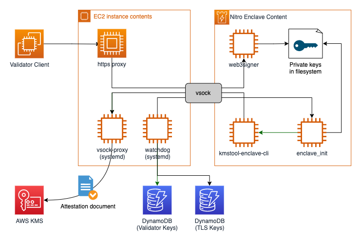

## Prerequisites

For this walkthrough, you must have the following prerequisites:

* An [AWS account](https://signin.aws.amazon.com/signin?redirect_uri=https%3A%2F%2Fportal.aws.amazon.com%2Fbilling%2Fsignup%2Fresume&client_id=signup)
* An [AWS Identity and Access Management](http://aws.amazon.com/iam) (IAM) user with administrator access
* [Configured AWS credentials](https://docs.aws.amazon.com/cdk/latest/guide/getting_started.html#getting_started_prerequisites)
* [Docker](https://docs.docker.com/get-docker/), [Node.js](https://nodejs.org/en/download/)
  , [Python 3.9](https://www.python.org/downloads/release/python-3916), [pip](https://pip.pypa.io/en/stable/installing/),
  and [jq](https://stedolan.github.io/jq/) installed on the workstation that you plan to deploy the solution from.

Note that the solution is **only** compatible with Python 3.9.

## Deploy the solution with AWS CDK

* virtual environments ([venv](https://docs.python.org/3/library/venv.html#module-venv)) are recommended working with
  Python
* AWS CDK per default leverages virtual environments.

   ```shell
   npm install -g aws-cdk && cdk –version
   ```

To install the sample application, complete the following steps:

1. Install the AWS CDK and test the AWS CDK CLI:

   ```shell
   npm install -g aws-cdk && cdk –version
   ```

2. Download the code from the GitHub repo and change to the new directory:

   ```shell
   git clone https://github.com/aws-samples/aws-nitro-enclave-blockchain-validator
   ```

3. Change to the `aws-nitro-enclave-blockchain-validator` repository:

   ```shell
   cd aws-nitro-enclave-blockchain-validator
   ```

4. Create a virtualenv. For macOS and Linux, use the command below. For other operating systems, refer to [Activating virtualenv](https://cdkworkshop.com/30-python/20-create-project/200-virtualenv.html)

   ```bash
   python3 -m venv .venv
   ```

5. After the init process completes and the virtualenv is created, activate your venv

   ```bash
   source .venv/bin/activate
   ```

6. Install the dependencies using the Python package manager:

   ```shell
   pip install -r requirements.txt
   ```

7. Build the required binaries for Nitro Enclaves. This step requires a valid local Docker environment.

   ```shell
   ./scripts/build_kmstool_enclave_cli.sh
   ```

   After you run this step, a new folder (application/eth2/enclave/kms) is available that contains the required Nitro Enclaves artifacts.

   If you encounter a problem with the `build_kmstool_enclave_cli.sh` step, such as a network connectivity issue, you can turn on the debug output of the script by changing set +x to set -x inside the script.

   For additional information, refer to the GitHub repo.

8. (Optional) If you have deployed the validator key table and KMS key using [Generate validator keys for Ethereum with trusted code in AWS Lambda and AWS Signer](https://github.com/aws-samples/eth-keygen-lambda-sam), modify the code in [app.py](../app.py) to specify the `kms_arn` and `validator_key_table_arn`. Else, skip this step.

9. Specify the AWS region and account for your deployment:
   ```shell
   export CDK_DEPLOY_REGION=us-east-1
   export CDK_DEPLOY_ACCOUNT=$(aws sts get-caller-identity | jq -r '.Account')
   ```
   
10. Deploy the sample code with the AWS CDK CLI:

   ```shell
   cdk deploy prodNitroValidator -O output.json
   ```

   AWS CDK asks for an additional confirmation to deploy the solution, as shown in the following screenshot.
  

11. Enter `y` to confirm.

   After the deployment is complete, the terminal shows us the additional parameters like the Auto Scaling group name.
   These values have also been written to `output.json` in JSON format.

   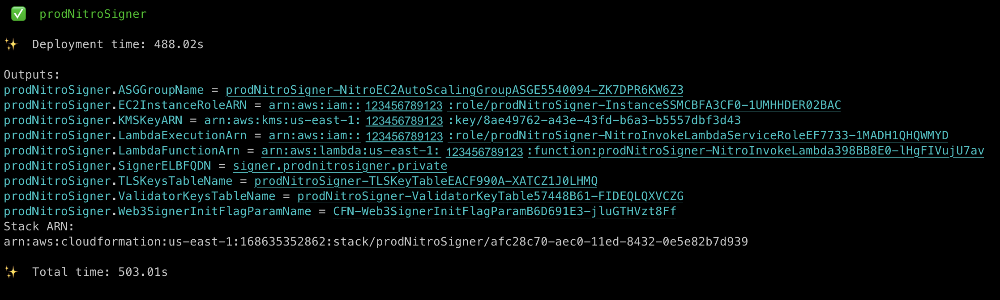

## Create TLS Artifacts and Eth2 Validator Keys and start Web3Signer Enclave

1. Create an environment variable pointing out the CloudFormation stack name:

    ```shell
    export CF_STACK_NAME=$(jq -r '. |= keys | .[0]' output.json)
    echo $CF_STACK_NAME 
    ```

2. Follow either one of the instruction below:


   **Option 1**: If you have deployed the validator key table and KMS key using [Generate validator keys for Ethereum with trusted code in AWS Lambda and AWS Signer](https://github.com/aws-samples/eth-keygen-lambda-sam), follow the instructions in that repository to generate and load the validator key.

   Retrieve the CloudFormation stack UUID

   ```bash
   CF_STACK_ARN=$(aws cloudformation describe-stacks --stack-name $CF_STACK_NAME --query "Stacks[0].StackId" --output text)
   echo $CF_STACK_ARN | sed 's/.*\///'
   ```

   You will receive an output similar to `40eec9d0-6a37-11ed-bce8-02f9df3f099e`

   In the DynamoDB table, observe that the `web3signer_uuid` column value is `none` for each row

   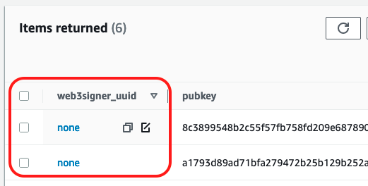

   Insert the UUID as the column value so that the key(s) are loaded into web3signer Nitro Enclave in the subsequent step. In the example below, the key starting with `8c38` will be loaded into web3signer while the key starting with `a179` will not be loaded.

   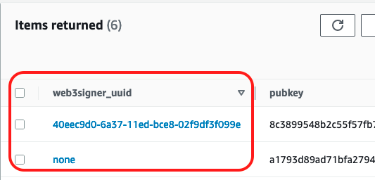


   **Option 2**: If you have deployed the validator key table and KMS key as part of this CDK application, you need to run a script to generate the validator keys and load into the DynamoDB table. Note that this method should only be used in non-production environments. You should use a secure method as depicted in Option 1 for production environments.

   Copy and paste the code below into a terminal and hit `enter/return` to generate and load validators key into DynamoDB table.
   The CloudFormation Stack ID will be automatically used as the `web3signer_uuid`:

   ```shell
   cd scripts/load_validator_keys
   pip3 install -r requirements.txt
   
   export DDB_TABLE_NAME=$(cat ../../output.json | jq -r ".${CF_STACK_NAME}.ValidatorKeysTableName")
   echo $DDB_TABLE_NAME

   export KMS_KEY_ARN=$(cat ../../output.json | jq -r ".${CF_STACK_NAME}.KMSKeyARN")
   echo $KMS_KEY_ARN

   python3 load_validator_keys.py
   cd ../..
   ```

   If successful, the public key portion of the just created validator key will be printed on the terminal:
   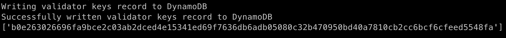

3. Generate the key policy and apply it to the KMS key. The `output.json` file created during the `cdk deploy` step
   needs to be passed as an input parameter. This step can take up to 15 seconds.

   **Option 1**: If you have deployed the validator key table and KMS key using [Generate validator keys for Ethereum with trusted code in AWS Lambda and AWS Signer](https://github.com/aws-samples/eth-keygen-lambda-sam), issue the following command:

   ```shell
   # "secure-keygen" refers to the CloudFormation stack name
   ./scripts/generate_key_policy.sh output.json secure-keygen
   ```

   The generated KMS key policy will look like this:

   ```json
    {
      "Version": "2012-10-17",
      "Statement": [
        {
          "Sid": "Enable decrypt from enclave",
          "Effect": "Allow",
          "Principal": {
            "AWS": "arn:aws:iam::123456789123:role/prodNitroValidator-InstanceSSMCBFA3CF0-USZMVEEATKPJ"
          },
          "Action": "kms:Decrypt",
          "Resource": "*",
          "Condition": {
            "StringEqualsIgnoreCase": {
              "kms:RecipientAttestation:ImageSha384": "a2dcbd226f77783f679c84a5335aad788043c69d4844b62b26b18d0c371114dd9cabfefe6be21383b45bd81a381966d9"
            }
          }
        },
        {
          "Sid": "Enable encrypt from lambda",
          "Effect": "Allow",
          "Principal": {
            "AWS": "arn:aws:iam::123456789123:role/prodNitroValidator-NitroInvokeLambdaServiceRoleEF7-FNGK7IQ19294"
          },
          "Action": [
            "kms:Encrypt",
            "kms:GenerateDataKey*"
          ],
          "Resource": "*"
        },
        {
          "Sid": "Enable encrypt from keygen lambda",
          "Effect": "Allow",
          "Principal": {
            "AWS": "arn:aws:iam::123456789123:role/secure-keygen-ValidatorKeyGenFunctionRole-16FJ049ZXJB2"
          },
          "Action": [
            "kms:Encrypt",
            "kms:GenerateDataKey*"
          ],
          "Resource": "*"
        },
        {
          "Effect": "Allow",
          "Principal": {
            "AWS": "arn:aws:iam::123456789123:root"
          },
          "Action": [
            "kms:Create*",
            "kms:Describe*",
            "kms:Enable*",
            "kms:List*",
            "kms:Put*",
            "kms:Update*",
            "kms:Revoke*",
            "kms:Disable*",
            "kms:Get*",
            "kms:Delete*",
            "kms:ScheduleKeyDeletion",
            "kms:CancelKeyDeletion",
            "kms:GenerateDataKey*",
            "kms:TagResource",
            "kms:UntagResource"
          ],
          "Resource": "*"
        }
      ]
    }
   ```

   **Option 2**:  If you have deployed the validator key table and KMS key as part of this CDK application, issue the following command:

   ```shell
   ./scripts/generate_key_policy.sh output.json
   ```

   The generated KMS key policy will look like this:

   ```json
    {
      "Version": "2012-10-17",
      "Statement": [
        {
          "Sid": "Enable decrypt from enclave",
          "Effect": "Allow",
          "Principal": {
            "AWS": "arn:aws:iam::123456789123:role/prodNitroValidator-InstanceSSMCBFA3CF0-USZMVEEATKPJ"
          },
          "Action": "kms:Decrypt",
          "Resource": "*",
          "Condition": {
            "StringEqualsIgnoreCase": {
              "kms:RecipientAttestation:ImageSha384": "a2dcbd226f77783f679c84a5335aad788043c69d4844b62b26b18d0c371114dd9cabfefe6be21383b45bd81a381966d9"
            }
          }
        },
        {
          "Sid": "Enable encrypt from lambda",
          "Effect": "Allow",
          "Principal": {
            "AWS": "arn:aws:iam::123456789123:role/prodNitroValidator-NitroInvokeLambdaServiceRoleEF7-FNGK7IQ19294"
          },
          "Action": [
            "kms:Encrypt",
            "kms:GenerateDataKey*"
          ],
          "Resource": "*"
        },
        {
          "Effect": "Allow",
          "Principal": {
            "AWS": "arn:aws:iam::123456789123:root"
          },
          "Action": [
            "kms:Create*",
            "kms:Describe*",
            "kms:Enable*",
            "kms:List*",
            "kms:Put*",
            "kms:Update*",
            "kms:Revoke*",
            "kms:Disable*",
            "kms:Get*",
            "kms:Delete*",
            "kms:ScheduleKeyDeletion",
            "kms:CancelKeyDeletion",
            "kms:GenerateDataKey*",
            "kms:TagResource",
            "kms:UntagResource"
          ],
          "Resource": "*"
        }
      ]
    }
   ```

4. To use the prepared KMS key policy, open the [AWS Management Console](http://aws.amazon.com/console) and navigate to the KMS section. Inside the KMS console, navigate to the KMS customer managed key that was created along with the other components. The key ID was printed out at the end of the deployment step `prodNitroSigner.KMSKeyARN`.
   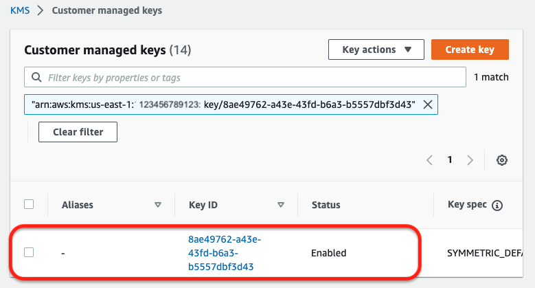

   On the **Key policy** tab, choose **Edit**.

   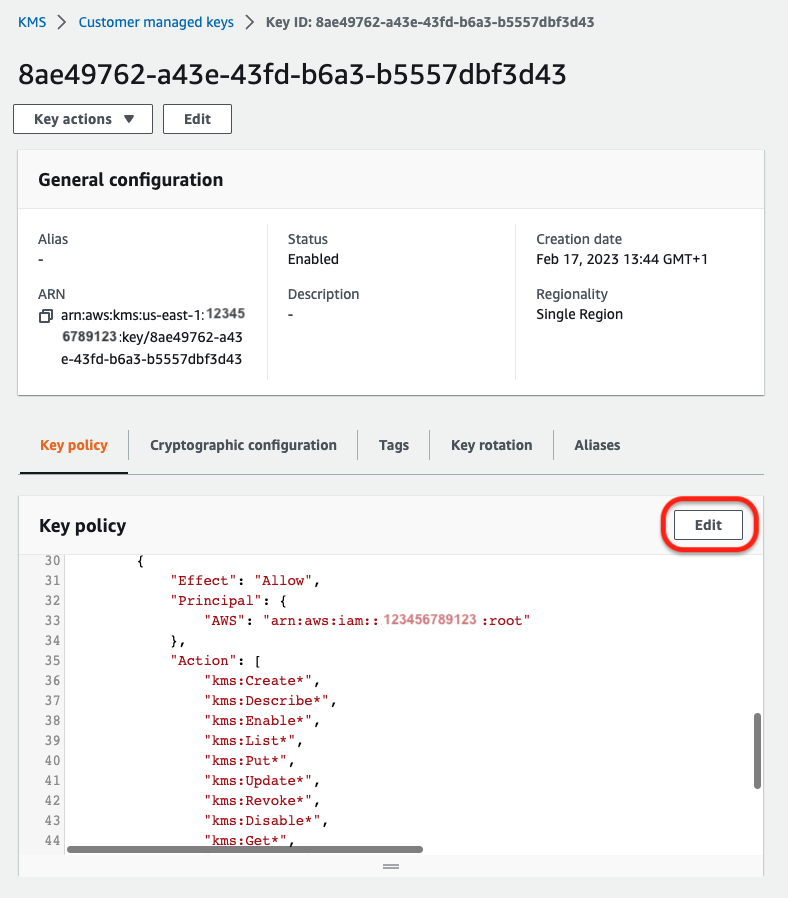

   Copy the prepared enclave key policy JSON document and replace the standard KMS key policy, then choose **Save changes**.
   

5. Use the Lambda `set_tls_key` function to store TLS key artifacts (password, keystore) in DynamoDB:

   ```bash
   FUNCTION_ARN=$(cat output.json | jq -r ".${CF_STACK_NAME}.LambdaFunctionArn")
   aws lambda invoke --function-name $FUNCTION_ARN \
      --cli-binary-format raw-in-base64-out \
      --payload '{"operation": "set_tls_key"}' lambda-output
   ```

   If successful, you will get back a status code `200` from Lambda as shown in the following screenshot:

   ```shell
   {
    "StatusCode": 200,
    "ExecutedVersion": "$LATEST"
   }
   ```

6. Start the `signing_service` daemon on all EC2 instances of the ASG (enclave, watchdog) via the following command:

   ```shell
   ./scripts/start_signing_service.sh output.json
   ```

   It's important that the `output.json`file does correspond with the most recent deployment. The script will take a few
   minutes to run. Output will be similar to:

   ```shell
   i-039c401dd22080c35:
   ● nitro-signing-server.service - Nitro Enclaves Signing Server Loaded: loaded (/etc/systemd/system/nitro-signing-server.service; enabled; vendor preset: disabled) Active: active (running) since Fri 2023-02-17 15:50:53 UTC; 17s ago Main PID: 9409 (python3) Tasks: 5 Memory: 26.1M CGroup: /system.slice/nitro-signing-server.service ├─9409 python3 /home/ec2-user/app/watchdog.py └─9444 /bin/nitro-cli run-enclave --cpu-count 2 --memory 3806 --eif-path /home/ec2-user/app/server/signing_server.eif --enclave-cid 16 Feb 17 15:50:53 ip-10-0-172-57.ec2.internal systemd[1]: Started Nitro Enclaves Signing Server. Feb 17 15:50:53 ip-10-0-172-57.ec2.internal watchdog.py[9409]: Start allocating memory... Feb 17 15:50:54 ip-10-0-172-57.ec2.internal watchdog.py[9409]: Started enclave with enclave-cid: 16, memory: 3806 MiB, cpu-ids: [1, 3]
   i-0442edc19a468a5a8:
   ● nitro-signing-server.service - Nitro Enclaves Signing Server Loaded: loaded (/etc/systemd/system/nitro-signing-server.service; enabled; vendor preset: disabled) Active: active (running) since Fri 2023-02-17 15:50:53 UTC; 17s ago Main PID: 10467 (python3) Tasks: 5 Memory: 26.2M CGroup: /system.slice/nitro-signing-server.service ├─10467 python3 /home/ec2-user/app/watchdog.py └─10500 /bin/nitro-cli run-enclave --cpu-count 2 --memory 3806 --eif-path /home/ec2-user/app/server/signing_server.eif --enclave-cid 16 Feb 17 15:50:53 ip-10-0-203-84.ec2.internal systemd[1]: Started Nitro Enclaves Signing Server. Feb 17 15:50:53 ip-10-0-203-84.ec2.internal watchdog.py[10467]: Start allocating memory... Feb 17 15:50:54 ip-10-0-203-84.ec2.internal watchdog.py[10467]: Started enclave with enclave-cid: 16, memory: 3806 MiB, cpu-ids: [1, 3]
   {
       "Version": 2,
       "Tier": "Standard"
   }
   
   (17/02/2023 16:51:15) service has been started and is healthy
   ```

   By the command you issued, you just triggered the following actions:
   * start signing_service
   * set initiated SSM flag to true

   ### Bootstrapping flow

   

      1. Signing systemd service will read encrypted `web3signer` config assets from DynamoDB
      2. Crypto assets will be passed into enclave along with AWS credentials
      3. `enclave_init` process will validate config assets.
      4. `kmstool-enclave-cli` will be used to decrypt the BLS12-381 private key and related information, required for Ethereum 2 validator signatures. The [`aws-nitro-enclaves-sdk-c`](https://github.com/aws/aws-nitro-enclaves-sdk-c) based tool uses the provided `vsock-proxy` to send `cryptographic attestation` enabled `decrypt` request to AWS KMS.
      5. AWS KMS will decrypt the configuration and [encrypt it with the enclaves public key](https://docs.aws.amazon.com/kms/latest/developerguide/services-nitro-enclaves.html#recipient-info) and send it back to `kmstool-enclave-cli`. The cli will then decrypt the configuration using the the enclaves private key and store it in the enclaves ephemeral storage.
      6. `enclave_init` will start the `web3signer` process. If the process has been started successfully, `enclave_init` will also start a separate `vsock-proxy` process inside the enclave.
      7. The validator client will need have `web3signer` configured as its remote signing solution, [e.g. Lighthouse Remote Signing](https://lighthouse-book.sigmaprime.io/validator-web3signer.html). When configured correctly, the validator client can execute an `TLS` handshake with the endpoint exposed by `http_server`.
      8. `http_server` acts like a TCP proxy that translates between [AF_INET](https://docs.python.org/3/library/socket.html#socket.AF_INET) and [AF_VSOCK](https://docs.python.org/3/library/socket.html#socket.AF_VSOCK). It accepts incoming requests from the validator client and forwards each TCP packet to proxy running inside the enclave via the `vsocket` connection. The proxy inside the enclave acts in reverse and translates `AF_VSOCK` to `AF_INET`. As a consequence of this setup, the proxy mechanism is transparent to the validator client that wants to establish an `https` connection with the `web3signer` process running inside the enclave. The connection, once established, is fully end-to-end encrypted. Furthermore, TLS termination is being done by the `web3signer` process running inside the enclave. As a result of that setup, the validator client is able to ensure the validity of the web3signer endpoint by controlling its X509 certificate.

7. Test the Web3Signer deployment from the Lambda function console to confirm that the Web3Signer is service is
   accessible remotely.
   On the Lambda console, choose the newly created Lambda function starting with the name `prodNitroSigner-NitroInvokeLambdaXXXXXXX-XXXXXXX`.

   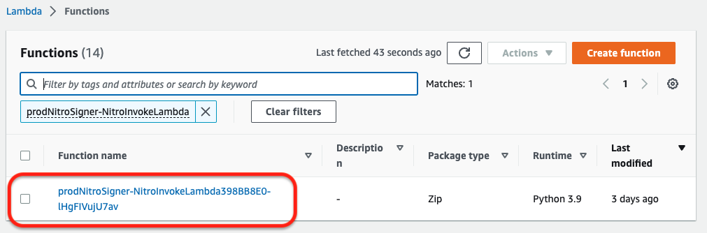

   After you choose the function, choose the **Test** tab.

   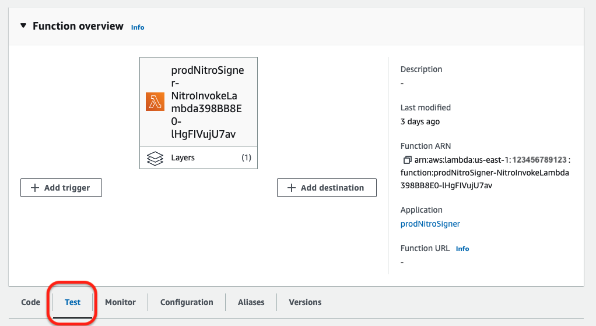

   To test the web3signer status, invoke the Lambda function via a test, passing the following JSON snippet as the payload.

   ```json
   {
     "operation": "web3signer_status"
   }
   ```

   Use `status` for `Event name`, choose **Save**, then choose **Test**.

   

   If the `web3signer_status` operation explained previously is successful, web3signer will respond with the text `OK`, which will also be printed out on the Lambda console.
   Internally this call leverages the [web3signer upcheck endpoint](https://docs.web3signer.consensys.net/HowTo/Get-Started/Start-Web3Signer/#confirm-web3signer-is-running) to confirm that the web3signer process is connected and running.

   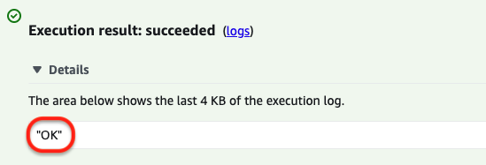

   In the same way as described above, `web3signer_public_keys` operation can be used from the Lambda console, which returns a hex-encoded list of Ethereum 2 BLS public keys for the private keys that have been loaded into web3signer. Internally this call is mapped to the [`Public Key` endpoint of the web3signer](https://consensys.github.io/web3signer/web3signer-eth2.html#tag/Public-Key).

   ```json
   {
     "operation": "web3signer_public_keys"
   }
   ```

   If successful, the response will look similar to this:

   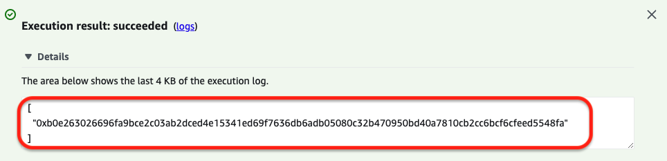

   ```json
   [
    "0xb0e263026696fa9bce2c03ab2dced4e15341ed69f7636db6adb05080c32b470950bd40a7810cb2cc6bcf6cfeed5548fa"
   ]
   ```

8. Now that the web3signer inside Nitro Enclave is up and running, you can configure the validator client to use remote signing. Note that validator client provisioning and setup are not part of this CDK application and you should follow the instruction of your preferred validator client software such as [Lighthouse](https://lighthouse-book.sigmaprime.io/validator-web3signer.html). The following is an example of Lighthouse remote-signing `validator_definitions.yml` configuration file:

    ```yaml
    - enabled: true
    voting_public_key: "INSERT_PUBLIC_KEY"
    type: web3signer
    url: "INSERT_URL_OF_WEB3SIGNER_LOAD_BALANCER"
    root_certificate_path: /path/to/web3signer-tls-cert.pem
    ```

    To get the web3signer load balancer FQDN, issue:

    ```bash
    cat output.json | jq -r ".${CF_STACK_NAME}.SignerELBFQDN"
    ```

    You can download the TLS root certificate from the TLS key DynamoDB table. You can find the table name by issuing the following command

    ```bash
    cat output.json | jq -r ".${CF_STACK_NAME}.TLSKeysTableName"
    ```

### Clean up

To avoid incurring future charges, delete the resources using the AWS CDK with the following command:

```shell
cdk destroy prodNitroValidator
```
